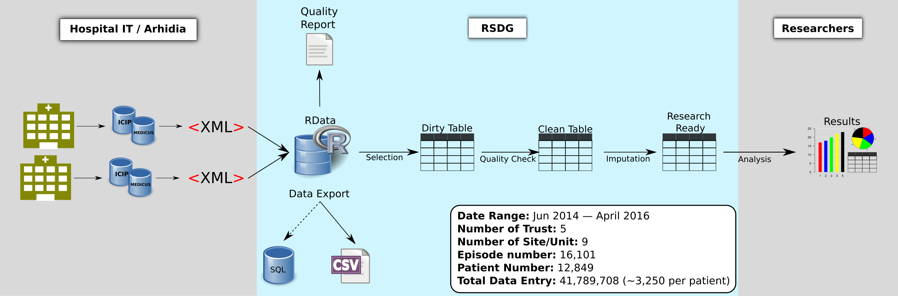

% Critical Care Project Report
% Research Software Development Group
% 7th July 2016

\newpage
# Introduction
The critical care patient data will be the cornerstone of many future medical
and health services research. However, the raw data need to be converted into
a research-ready structure to enable and ease its scientific analysis.
Thus, to cover that gap the data have to be transformed into a queryable form
and its properties and quality to be understood. 
The UCL Research Software Development Group's mission 
is to provide an open source software solution to
bridge this gap and deliver the ready-to-use data alongside with the data
manipulation tools for the researchers. 

We have built a pipeline which converts the `XML` raw data to the queryable RData format.
Additionally enabling to export the resultant data into `CSV` format to
be used outside R (_e.g._, with Excel). 
A business readable data quality check dictionary is used in the pipeline to 
clean the data. The non-validated data are
either modified or removed according to the such criteria. Subsequently, an
auto-generated data quality report is produced to report the key fields
missingness and data sanity by each site and unit. By the end of the pipeline the
researchers obtain a R table which is queryable and
validated. We also have demonstrated the ability of deriving data products, such as
SOFA score from physiology data and identification of sepsis. A publication 
about this process is in due course.

We believe a robust, understandable and accessible software is
the first step of solid research. Therefore, beyond the functionalities, 
we focus in the usability and sustainability of
the software produced. All of our development is constantly updated in the
GitHub platform which is accessible to all the allowed users.  The installation process of
our software aims to simplicity. The code is self-explanatory and well
documented providing accessibility to the  (empowering?) users and future
developers. Testings are conducted after any modification of code automatically
on the Travis CI system. Overall this ensures the software to be a gateway to the data which
plays a critical role in the future success of the community.

# The Data Process Pipeline


## The XML data and the Data Safe Haven
Data associated with more than 12,000 patients from five NHS trusts are available
in `XML` format. The data were drawn from the ICIP and Medicuse databases which
contains demographic, drugs, laboratory, nursing and physiology data. The
de-identifiable and identifiable data are processed locally and on the
UCL Data Safe haven (IDHS) respectively.  In order to create the pipeline on IDHS, we
requested and configured a Linux virtual environment. Due to the limited capacity of
IDHS, it is still useful to keep a local de-identifiable copy for development
purposes. The pipeline is designed to be portable on multiple platforms. It can be
executed on both local environments and IDHS with de-identifiable and 
identifiable data. 

## XML parser

The `XML` parser in R combines and restructures the `XML` files into a newly defined R
data structure `ccRecord`, which significantly improves the clarity of the
data by organising it under tables and removing the redundancy of the `XML`
files. `ccRecord` is designed as a flexible, simplified, and queryable data
structure for critical care measurements. Data in `ccRecord` format is eventually
stored in a RData file which is about 500 times smaller than the original `XML`
files.  In addition the data provenance is recorded by each episode, henceforth
we are able to tell from which file each episode comes and when
it has been parsed. The selected data fields can be exported into a `CSV` file for
Excel users or to be used with any other analysis tool or programming language.

It is worth mentioning that a `C++` equivalent `XML` parser, which has a much better
performance comparing to the currently used in R, has been developed but not deployed yet due
to the time constraints of the project. The incorporation of the `C++` parser into the
pipeline will boost the speed in which all the files are converted.

## Auto-generated quality report
Data may have imperfections in various ways. Therefore a synthetic quality
assessment that allows us to report back to the data source is
extremely useful. An automatic generated data quality report which reflects the
quality issues have been developed and deployed. Based on the report, we are able to
inform the major missingness issues and some data sanity problems together with basic
information such as the duration, sites, number of episodes, and number of
patients.

## Data validation and cleaning
Data validation and cleaning functions in included in the `ccdata`
package. Data sanity check is conducted in many aspects regarding to the
intrinsic property of the individual fields. There are three major validations:
the numeric range, the text category, and the missingness. The users are
required to fill a `yaml` form to guide the validation check. Consequently,
the data is flagged accordingly to the the level of the data sanity
excluding the data that do
not make sense. 
After this stage, 
we are able to deliver a "cleaned" and queryable R table to the researchers.
Next section discusses in more detail the `yaml` dictionary.

# The R package: ccdata
The ccdata R package is the centralised toolset we developed for pipelining and data
manipulation. The package bundles not only all the R/C++ code but also
documentation and tests together, which makes the code sharing easier. The
ccdata package is portable in almost all platforms where R environment is
provided. It can be installed effortlessly on Windows or Unix based systems.
Although it is necessary to have some further tidy-ups in the subsequent
development cycle, in the current stage, the main part of the R code is well
documented and properly tested. 

In order to prepare the first paper, many data manipulation processes are
needed. Instead of making some one-off scripts, we incorporated the data
manipulation processes as re-usable functions in our ccdata package. The
frequently functions such as detecting unique patient and spell and data
imputation can be called from the package, which reduced the duplication of
work in the future. The package is still growing as the research goes on.  

## Data Selection and cleaning in the yaml configuration
Notwithstanding the fact that to be able use and program with ccdata package
offers a great flexibility in data analysis, the pipeline can be performed
without any programming knowledge. The users can run the pipeline by only
filling the yaml configuration file. The yaml form is straight forward and
self-explanatory for non-programmers. The user selected data fields with the
the cleaning process can be provided by the end of the pipeline in a single CSV
file which can be open in MS Excel. 

Here is an example of the yaml data cleaning configuration of heart
rate, in which three filters __nodata__, __range__, __missingness__ are
presented in the following data selection and cleaning configuration. 

```Python
NIHR_HIC_ICU_0108:
  shortName: hrate
  dataItem: Heart rate
  distribution: normal
  decimal_places: 0

  # filter1: do not use the episode where hrate cannot be found.
  nodata:     
     apply: drop_episode

  # filter2: mark all the values based on reference range (traffic colour) remove entries where the range check is not fullfilled.  
  range:  
      labels:
          red: (0, 300)
          amber: (0, 170) 
          green: (50, 150)
      apply: drop_entry

  # filter3: compute the item missing rate on given cadences; in this case, we compute the daily (red) and hourly (amber) missing rate, and only accpet episodes of which hourly missing rate (amber) is lower than 30%. 
  missingness: 
      labels:
          red: 24
          amber: 1
      accept_2d:
          amber: 70 
  apply: drop_episode 
```

# Summary

The RSDG got involved in the critical care data project since January 2016. In
the last six months, we participated the paper preparation with the critical
care team, meanwhile developed the re-usable and sustainable software tools for
the data pipeline and data manipulation. In the potential next phase of this
project, we will focus on the linkage of the data of other HIC groups and
external sources. We will continue our support to the researchers by providing
sustainable software tools. 
